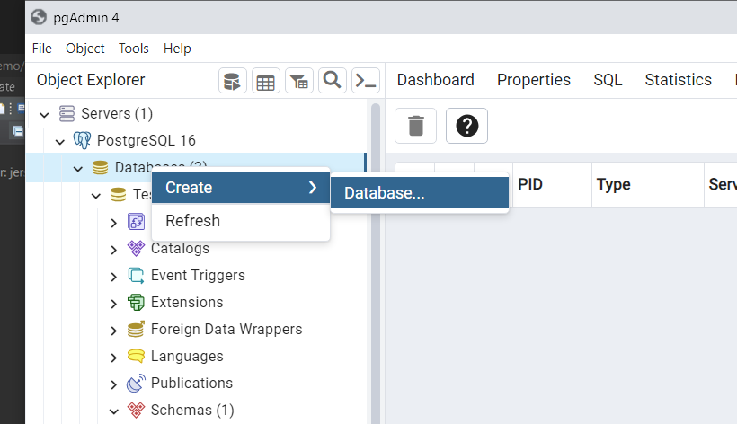
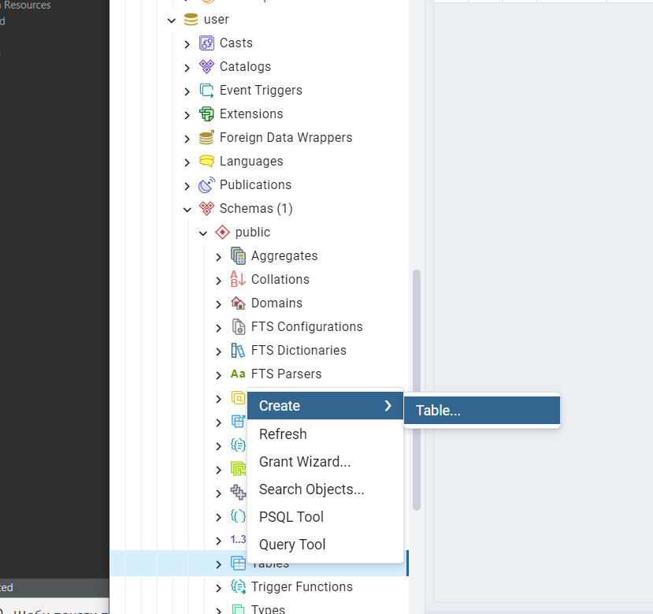
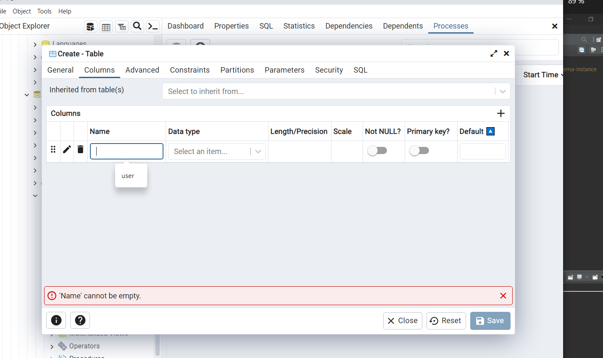

# restful-with-java-jersey
У цьому репозиторії розміщено туторіал для створення базового RESTful-сервісу
мовою Java за допомогою фреймворку Eclipse Jersey.

Для створення нашого сервісу необхідно завантажити:
- Eclipse IDE
- PostgreSQL
- Apache Tomcat 10.0 для запуску сервера
- Postman для тестування

Після встановлення наведених вище програм можна повторити дії, наведені
нижче у вказівках. Крім того, у папці "src" цього репозиторію можна знайти вихідний
текст готової програми, а також вказівки, як її запустити.

# 0. Основні поняття
Eclipse Jersey (у минулому - Glassfish Jersey) - це open-source фреймворк
для розробки RESTful веб-сервісів мовою Java. Цей фреймворк підтримує
JAX-RS API та є еталонною реалізацією AX-RS (JSR 311 & JSR 339 & JSR 370).

Jersey Servlet Container - це контейнер сервлетів, який використовується для обробки запитів у веб-додатках,
побудованих з використанням Jersey, який є реалізацією специфікації JAX-RS (Java API for RESTful Web Services).

Коли ви використовуєте Jersey для розробки RESTful сервісів, ви можете використовувати Jersey Servlet Container
для розгортання вашого додатка і обробки HTTP-запитів, пов'язаних з вашими ресурсами JAX-RS. Jersey інтегрується
з контейнером сервлетів, таким як Apache Tomcat чи іншим, і надає механізми для обробки REST-запитів через сервлети
в вашому веб-додатку.

Коли користувач робить HTTP-запит до ресурсу, який ви визначили у своєму Jersey-додатку, Jersey Servlet Container
відповідає на цей запит, і ресурс JAX-RS викликається для обробки запиту та генерації відповіді.


# 1. Створення проєкту
Заходимо в Eclipse та виконуємо File - New - Dynamic Web Project:


Вводимо Project name, натискаємо Next -> Next ->

Ставимо галочку біля "Generate web.xml for deployment descriptor" і натискаємо Finish.

Після цих дій бачимо новостворений проєкт.

Далі нам необхідно додати бібліотеки Jersey. Для цього конвертуємо проєкт в Maven Project.
Клікаємо ПКМ по проєкту, натискаємо Configure - Convert to Maven Project.


У вікні створення pom.xml вказуємо GroupId та ArtifactId, можна залишити як є.


Після цього відкриється наш pom.xml. Тепер залишилося додати необхідні dependencies в тегу project:

```xml
<dependencies>
    <dependency>
        <groupId>org.glassfish.jersey.containers</groupId>
        <artifactId>jersey-container-servlet</artifactId>
        <version>3.1.0-M2</version>
    </dependency>
    <dependency>
        <groupId>org.glassfish.jersey.inject</groupId>
        <artifactId>jersey-hk2</artifactId>
        <version>3.1.0-M2</version>
    </dependency>
    <dependency>
        <groupId>org.postgresql</groupId>
        <artifactId>postgresql</artifactId>
        <version>42.6.0</version>
    </dependency>
    <dependency>
        <groupId>jakarta.ws.rs</groupId>
        <artifactId>jakarta.ws.rs-api</artifactId>
        <version>3.1.0</version>
    </dependency>
    <dependency>
        <groupId>org.glassfish.jersey.media</groupId>
        <artifactId>jersey-media-json-jackson</artifactId>
        <version>3.1.0-M2</version>
    </dependency>
    <dependency>
        <groupId>jakarta.ws.rs</groupId>
        <artifactId>all</artifactId>
        <version>3.1.0</version>
        <type>pom</type>
    </dependency>
</dependencies>
```
Після збереження pom.xml маємо бачити всі додані бібліотеки:


# 2. Створення простого RESTful-сервісу
 У рамках цієї доповіді створимо RESTful-сервіс з управління однією таблицею User. Використовувати будемо PostgreSQL.

Заходимо в pgAdmin, і створюємо відповідну таблицю.

Алгоритм дій в pg: 
- створити сервер, якщо його ще немає
- Databases -> Create -> Database


- вводимо назву БД, наприклад, Users, натискаємо Save
- У новостворенії БД обираємо Schemas -> Tables, ПКМ по Tables -> Create -> Table

- вводимо назву (у прикладі users), у вкладці Columns додаємо три колонки: user_id (int), user_name, role та user_email (varchar(50))

На цьому початкове налаштування таблиці закінчили. 
Створимо представлення Entity User з таблиці. Створюємо клас Users:

```java 
package userRestful;


public class Users {
    private Integer user_id;
    private String user_name;
    private String user_email;
    private String role;
    private Integer getUser_id() {
        return user_id;
    }
    public void setUser_id(Integer user_id) {
        this.user_id = user_id;
    }
    public String getUser_name() {
        return user_name;
    }
    public void setUser_name(String user_name) {
        this.user_name = user_name;
    }
    public String getUser_email() {
        return user_email;
    }
    public void setUser_email(String user_email) {
        this.user_email = user_email;
    }
    public String getRole() {
        return user_email;
    }
    public void setRole(String role) {
        this.role = role;
    }
} 
```
У цьому коді створюємо поля з такими самими назвами, як у таблиці, та створюємо для них гетери та сетери.

У тій самій папці створимо новий клас UserRepository. Цей клас використаємо, щоб підключитися до таблиці.
```java
package userRestful;

import java.sql.Connection;
import java.sql.DriverManager;
import java.sql.ResultSet;
import java.sql.Statement;
import java.util.ArrayList;
import java.util.List;

public class UserRepository {
    Connection con = null;
    public UserRepository() {
        String user_name = "postgres";
        String password = "1234";
        try {
            Class.forName("org.postgresql.Driver");
            con = DriverManager.getConnection("jdbc:postgresql://localhost/users", user_name, password);

        } catch (Exception e) {
            e.printStackTrace();
        }
    }
    public List<Users> getUsers() {
        List<Users> users = new ArrayList<>();
        String sql = "select * from users;";
        try {
            Statement stmt = con.createStatement();
            ResultSet rs = stmt.executeQuery(sql);
            while (rs.next()) {
                Users u = new Users();
                u.setUser_id(rs.getInt(1));
                u.setUser_name(rs.getString(2));
                u.setUser_email(rs.getString(3));
                u.setRole(rs.getString(4));
                users.add(u);
            }
        } catch (Exception e) {
            e.printStackTrace();
        }
        return users;
    }
}

```
У цьому коді: 
- вводимо ім'я адміністратора та пароль від постгрес
- підключаємо драйвер для постгресу, та у посиланні вказуємо нашу таблицю
- вже створений код для першої CRUD-операції "get all users"

Якщо виникають проблеми з підключенням бібліотек, ПКМ по проєкту -> Maven -> Update Project.

Після цього в тій самій папці створимо останній клас - UserResource.

```java
package userRestful;

import java.util.List;

import com.google.gson.Gson;

import jakarta.ws.rs.GET;
import jakarta.ws.rs.Path;
import jakarta.ws.rs.Produces;
import jakarta.ws.rs.core.MediaType;

@Path("users")
public class UserResource {
    UserRepository repo = new UserRepository();
    @GET
    public String getUsers() {
        return new Gson().toJson(repo.getUsers());
    }
}

```
Цей клас використовуємо для створення URI-шляхів для нашого сервісу.
# 3. Конфігурація Jersey Servlet Container

Знаходимо в src/webapp/WEB-INF файл web.xml.
Цей web.xml файл конфігурує ваш веб-додаток для використання Jersey у якості фреймворку для створення 
RESTful веб-сервісів.

У файл записуємо: 

```xml
<?xml version="1.0" encoding="UTF-8"?>
<web-app xmlns:xsi="http://www.w3.org/2001/XMLSchema-instance"
         xmlns="https://jakarta.ee/xml/ns/jakartaee"
         xsi:schemaLocation="https://jakarta.ee/xml/ns/jakartaee https://jakarta.ee/xml/ns/jakartaee/web-app_5_0.xsd"
         version="5.0">

    <display-name>userRestful</display-name>

    <servlet>
        <servlet-name>jersey-serlvet</servlet-name>
        <servlet-class>org.glassfish.jersey.servlet.ServletContainer</servlet-class>
        <init-param>
            <param-name>jersey.config.server.provider.packages</param-name>
            <param-value>userRestful</param-value>
        </init-param>
        <load-on-startup>1</load-on-startup>
    </servlet>

    <servlet-mapping>
        <servlet-name>jersey-serlvet</servlet-name>
        <url-pattern>/rest/*</url-pattern>
    </servlet-mapping>

</web-app>
```
Розглянемо кожен елемент цього файлу:

- web-app: Основний елемент, що описує початок конфігураційного файлу веб-додатка.

- display-name: Вказує ім'я вашого веб-додатка, яке може використовуватися в адміністративних інтерфейсах сервера.

- servlet: Описує сервлет, який обробляє запити до вашого веб-додатка.

- servlet-name: Ім'я сервлета.

- servlet-class: Повний шлях до класу, який відповідає за обробку запитів. Використовується org.glassfish.jersey.servlet.ServletContainer, 
- який є частиною Jersey і відповідає за обробку запитів JAX-RS.

- init-param: Параметри ініціалізації для сервлета. 

- servlet-mapping: Встановлює відповідність між сервлетом і URL-шляхом, за яким буде доступний сервлет.

- servlet-name: Ім'я сервлета, що мапиться. В цьому випадку, "Java RESTful service".

- url-pattern: URL-шлях, за яким буде доступний сервлет. Всі запити, що співпадають з цим шаблоном, будуть направлені до 
- вказаного сервлета. У цьому випадку, "/rest/*" означає, що сервлет буде доступний за шляхом "/rest/..." (де "..." - може бути будь-яким шляхом).

# 4. Тестування першої функції
Для тестування поки використаємо лише браузер (тестуємо GET-запит). 
- ПКМ по проєкту -> Run as -> Run on Server
- обираємо існуючий сервер або створюємо новий (Apache Tomcat 10.0) -> Next -> Finish
- маємо бачити повідомлення про те, що сервер запустився

- переходимо за адресою http://localhost:8080/userRestful/rest/users (залежить від конфігурації вашого проєкту): userRestful -
з display-name web.xml, /rest - з url-pattern, users - з UserResource.
- маємо отримати пустий масив, бо ми ще не додавали юзерів.

- додамо юзера з pgAdmin і подивимося на зміни


# 5. Розширення функціональності сервісу.