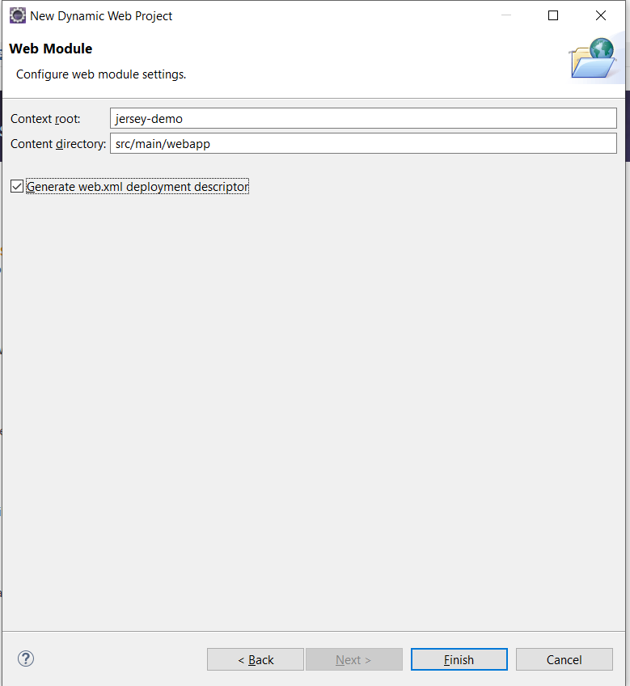
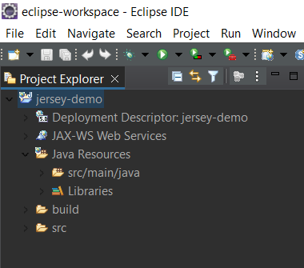
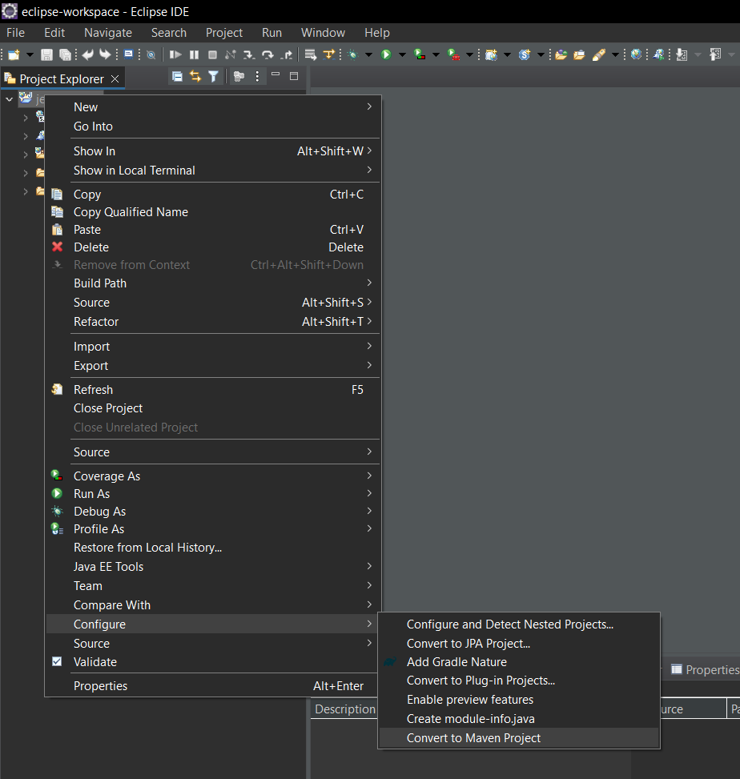
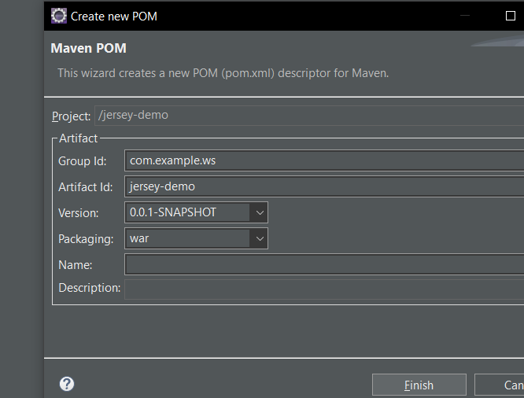
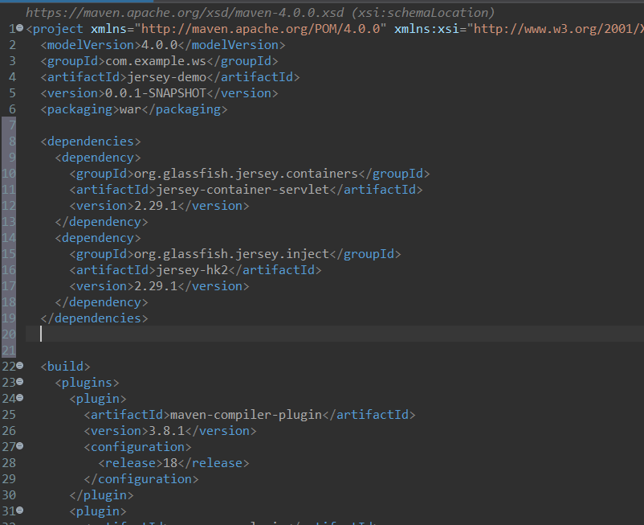
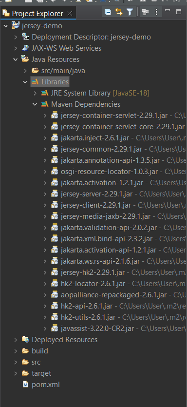

# restful-with-java-jersey
У цьому репозиторії розміщено туторіал для створення базового RESTful-сервісу
мовою Java за допомогою фреймворку Eclipse Jersey.

Eclipse Jersey (у минулому - Glassfish Jersey) - це open-source фреймворк
для розробки RESTful веб-сервісів мовою Java. Цей фреймворк підтримує
JAX-RS API та є еталонною реалізацією AX-RS (JSR 311 & JSR 339 & JSR 370).

Для створення нашого сервісу необхідно завантажити:
- Eclipse IDE
- Postman для тестування

Після встановлення наведених вище програм можна повторити дії, наведені
нижче у вказівках. Крім того, у папці "src" цього репозиторію можна знайти вихідний
текст готової програми, а також вказівки, як її запустити.

# 1. Створення проєкту
Заходимо в Eclipse та виконуємо File - New - Dynamic Web Project:


Вводимо Project name, натискаємо Next -> Next ->


Ставимо галочку біля "Generate web.xml for deployment descriptor" і натискаємо Finish:


Після цих дій бачимо новостворений проєкт. Структура папок має виглядати так:


Далі нам необхідно додати бібліотеки Jersey. Для цього конвертуємо проєкт в Maven Project.
Клікаємо ПКМ по проєкту, натискаємо Configure - Convert to Maven Project.


У вікні створення pom.xml вказуємо GroupId та ArtifactId (відповідно до назви проєкту).


Після цього відкриється наш pom.xml. Тепер залишилося додати dependencies в тегу project:

```xml
<dependencies>
    <dependency>
        <groupId>org.glassfish.jersey.containers</groupId>
        <artifactId>jersey-container-servlet</artifactId>
        <version>2.29.1</version>
    </dependency>
    <dependency>
        <groupId>org.glassfish.jersey.inject</groupId>
        <artifactId>jersey-hk2</artifactId>
        <version>2.29.1</version>
    </dependency>
</dependencies>
```

Загалом, виглядатиме так:


Після збереження pom.xml маємо бачити всі додані бібліотеки:


# 2. 